# mic

mic (mina-is-cute) is a modular Go proxy for controlling outbound TLS fingerprints.
It lets you specify a JA4-TLS hash and the proxy will use the corresponding `uTLS`
preset when connecting to upstream servers, making your traffic look like a specific
browser to any fingerprinting system.

Two modes are supported:

- **client-front** — standard HTTP CONNECT proxy. Your tool (curl, browser, etc.)
  connects through the proxy; the proxy dials upstream with the configured fingerprint.
- **server-front** — the proxy terminates incoming TLS (with your cert/key), then
  re-dials the backend with the configured fingerprint. Useful when the client
  cannot be configured to use a CONNECT proxy.

---

## How it works

```mermaid
sequenceDiagram
    participant C as Client
    participant P as mic proxy
    participant T as Target

    rect rgb(30, 30, 60)
        note over C,T: client-front mode
        C->>P: HTTP CONNECT target:443
        P-->>C: 200 Connection Established
        P->>T: TCP + uTLS handshake (configured fingerprint)
        C->>P: raw HTTP bytes
        P->>T: bytes encrypted in uTLS tunnel
        T-->>P: HTTP response (through uTLS)
        P-->>C: raw HTTP response
    end

    rect rgb(30, 60, 30)
        note over C,T: server-front mode
        C->>P: TLS handshake (proxy cert)
        P-->>C: TLS established
        P->>T: TCP + uTLS handshake (configured fingerprint)
        C->>P: raw HTTP bytes (decrypted by proxy)
        P->>T: bytes encrypted in uTLS tunnel
        T-->>P: HTTP response (through uTLS)
        P-->>C: HTTP response (re-encrypted for client)
    end
```



In both modes the target sees a TLS handshake that matches the configured JA4 hash,
not the default Go TLS fingerprint.

---

## Build

```bash
go build -o mic .
```

Or with the helper script (builds and creates `mic.toml` from the example):

```bash
scripts/setup.sh
```

---

## Configuration

Copy the example config and edit it:

```bash
cp mic.example.toml mic.toml
```

```toml
mode = "client-front"   # or "server-front"

[listen]
addr = ":8080"

[backend]
addr = "127.0.0.1:443"   # server-front only

[fingerprint]
[fingerprint.tls]
ja4 = "t13d1516h2_8daaf6152771_b0da82dd1658"   # Chrome 120

# server-front only
[fingerprint.tls.termination]
cert = "/path/to/cert.pem"
key  = "/path/to/key.pem"

[ca]
cert = ""   # optional: custom CA for upstream verification
```

### Available JA4 fingerprints

| JA4 hash | Browser |
|---|---|
| `t13d1516h2_8daaf6152771_b0da82dd1658` | Chrome 120 |
| `t13d1516h2_8daaf6152771_e5627efa2ab1` | Chrome 120 (post-quantum) |
| `t13d1517h2_8daaf6152771_b1ff8ab2d16f` | Firefox 120 |
| `t13d1516h2_8daaf6152771_4aeede8da0ac` | Safari 16.0 |
| `t13d1516h2_8daaf6152771_f5b4b24de8b1` | Edge 106 |

---

## Running

```bash
./mic --config mic.toml
```

### client-front

Configure your client to use an HTTP CONNECT proxy at the listen address:

```bash
curl -x http://localhost:8080 https://tls.peet.ws/api/all
# check the "ja4" field in the response
```

### server-front

Generate a self-signed certificate for the proxy to present to clients:

```bash
go run $(go env GOROOT)/src/crypto/tls/generate_cert.go --host="localhost,127.0.0.1"
# produces cert.pem and key.pem
```

Set `mode = "server-front"`, point `fingerprint.tls.termination.cert/key` at those
files, and set `backend.addr` to your upstream. Then connect directly to the proxy
address with a TLS client.

### Stop

```bash
scripts/cleanup.sh
```

---

## Testing

Unit tests:

```bash
go test ./...
```

Integration tests (spin up in-process TLS servers, no external dependencies):

```bash
scripts/run_integration_tests.sh
# or: go test -tags integration -v ./proxy/...
```
