# mic

mic (mina-is-cute) is a modular Go proxy for controlling outbound TLS fingerprints.
It lets you specify a JA4-TLS hash and the proxy will use the corresponding `uTLS`
preset when connecting to upstream servers, making your traffic look like a specific
browser to any fingerprinting system.

Two modes are supported:

- **client-front** — HTTP CONNECT proxy with MitM TLS interception. The proxy
  generates a local CA, issues per-host leaf certs on the fly, terminates TLS from
  the client, and re-dials the target with the configured uTLS fingerprint. Standard
  tools (curl, browsers) work after importing the CA once.
- **server-front** — the proxy terminates incoming TLS (with your own cert/key), then
  re-dials the backend with the configured fingerprint. Useful when the client cannot
  be configured to use a CONNECT proxy.

---

## How it works

```mermaid
sequenceDiagram
    participant C as Client
    participant P as mic proxy
    participant T as Target

    rect rgb(30, 30, 60)
        note over C,T: client-front mode (MitM TLS)
        C->>P: HTTP CONNECT target:443
        P->>T: TCP + uTLS handshake (configured fingerprint)
        P-->>C: 200 Connection Established
        C->>P: TLS handshake (mic-issued cert for target)
        P-->>C: TLS established
        C->>P: HTTP request (decrypted by proxy)
        P->>T: request bytes (through uTLS tunnel)
        T-->>P: HTTP response (through uTLS)
        P-->>C: HTTP response (re-encrypted for client)
    end

    rect rgb(30, 60, 30)
        note over C,T: server-front mode
        C->>P: TLS handshake (proxy cert)
        P-->>C: TLS established
        P->>T: TCP + uTLS handshake (configured fingerprint)
        C->>P: HTTP request (decrypted by proxy)
        P->>T: request bytes (through uTLS tunnel)
        T-->>P: HTTP response (through uTLS)
        P-->>C: HTTP response (re-encrypted for client)
    end
```



In both modes the target sees a TLS handshake that matches the configured JA4 hash,
not the default Go TLS fingerprint.

---

## Build

```bash
go build -o mic .
```

Or with the helper script (builds, creates `mic.toml`, starts the proxy, and prints
CA trust instructions):

```bash
scripts/setup.sh
```

---

## Configuration

Copy the example config and edit it:

```bash
cp mic.example.toml mic.toml
```

```toml
mode = "client-front"   # or "server-front"

[listen]
addr = ":8080"

[backend]
addr = "127.0.0.1:443"   # server-front only

[fingerprint]
[fingerprint.tls]
ja4 = "t13d1516h2_8daaf6152771_b0da82dd1658"   # Chrome 120

# server-front only: certificate mic presents to clients
[fingerprint.tls.termination]
cert = "/path/to/cert.pem"
key  = "/path/to/key.pem"

[ca]
cert = ""   # optional: custom CA for verifying upstream targets

# client-front only: local MitM CA.
# mic creates these files on first run and reuses them across restarts.
# Import ca.pem into curl / your browser / the system trust store.
[ca.intercept]
cert = "ca.pem"
key  = "ca-key.pem"
```

### Available JA4 fingerprints

Hashes are measured by `cmd/probe` against tlsinfo.me and reflect what each utls
preset actually emits. Re-run the probe after upgrading the utls dependency.

| JA4 hash | Preset |
|---|---|
| `t13d1516h2_8daaf6152771_02713d6af862` | Chrome 120 (`HelloChrome_120`) |
| `t13d1715h2_5b57614c22b0_5c2c66f702b0` | Firefox 120 (`HelloFirefox_120`) |
| `t13d2014h2_a09f3c656075_14788d8d241b` | Safari 16.0 (`HelloSafari_16_0`) |
| `t13d1516h2_8daaf6152771_e5627efa2ab1` | Edge 106 (`HelloEdge_106`) |

> `HelloChrome_120_PQ` (post-quantum) produces the same JA4 as Chrome 120 because
> the X25519MLKEM768 key share is not distinguished by JA4. It is not separately
> selectable via config hash.

---

## Running

```bash
./mic --config mic.toml
```

### client-front

Set `mode = "client-front"` and configure `[ca.intercept]` with paths for the local
CA cert and key. mic will create them on first run.

**Trust the CA once** (pick whichever applies):

```bash
# curl — pass --cacert on every invocation, or set CURL_CA_BUNDLE
curl --cacert ca.pem -x http://localhost:8080 https://tlsinfo.me/json

# Debian / Ubuntu / Kali — add to system store
sudo cp ca.pem /usr/local/share/ca-certificates/mic-ca.crt
sudo update-ca-certificates

# macOS
sudo security add-trusted-cert -d -r trustRoot -k /Library/Keychains/System.keychain ca.pem
```

After trusting the CA, standard tools work without extra flags:

```bash
curl -x http://localhost:8080 https://tlsinfo.me/json
# check the "ja4" field — it should match your configured fingerprint
```

### server-front

Generate a self-signed certificate for the proxy to present to clients:

```bash
go run $(go env GOROOT)/src/crypto/tls/generate_cert.go --host="localhost,127.0.0.1"
# produces cert.pem and key.pem
```

Set `mode = "server-front"`, point `fingerprint.tls.termination.cert/key` at those
files, and set `backend.addr` to your upstream. Then connect directly to the proxy
address with a TLS client.

### Stop

```bash
scripts/cleanup.sh
```

---

## Testing

Unit tests:

```bash
go test ./...
```

Integration tests (spin up in-process TLS servers, no external dependencies):

```bash
scripts/run_integration_tests.sh
# or: go test -tags integration -v ./proxy/...
```
