# mic

mic (mina-is-cute) is a modular Go proxy for controlling outbound TLS fingerprints.
It lets you pick a browser fingerprint profile and the proxy will use the corresponding
`uTLS` preset when connecting to upstream servers, making your traffic look like a
specific browser to any fingerprinting system.

Two modes are supported:

- **client-front** — HTTP CONNECT proxy with optional MitM TLS interception. The proxy
  generates a local CA, issues per-host leaf certs on the fly, terminates TLS from
  the client, and re-dials the target with the configured uTLS fingerprint. Standard
  tools (curl, browsers) work after importing the CA once.
- **server-front** — the proxy terminates incoming TLS (with your own cert/key), then
  re-dials the backend with the configured fingerprint. Useful when the client cannot
  be configured to use a CONNECT proxy.

---

## How it works

```mermaid
sequenceDiagram
    participant C as Client
    participant P as mic proxy
    participant T as Target

    rect rgb(30, 30, 60)
        note over C,T: client-front mode (MitM TLS)
        C->>P: HTTP CONNECT target:443
        P->>T: TCP + uTLS handshake (configured fingerprint)
        P-->>C: 200 Connection Established
        C->>P: TLS handshake (mic-issued cert for target)
        P-->>C: TLS established
        C->>P: HTTP request (decrypted by proxy)
        P->>T: request bytes (through uTLS tunnel)
        T-->>P: HTTP response (through uTLS)
        P-->>C: HTTP response (re-encrypted for client)
    end

    rect rgb(30, 60, 30)
        note over C,T: server-front mode
        C->>P: TLS handshake (proxy cert)
        P-->>C: TLS established
        P->>T: TCP + uTLS handshake (configured fingerprint)
        C->>P: HTTP request (decrypted by proxy)
        P->>T: request bytes (through uTLS tunnel)
        T-->>P: HTTP response (through uTLS)
        P-->>C: HTTP response (re-encrypted for client)
    end
```



In both modes the target sees a TLS handshake that matches the configured fingerprint,
not the default Go TLS fingerprint.

---

## Build

```bash
go build -o mic .
```

---

## Running

### client-front

```bash
mic client --listen :8080 --fingerprint chrome-120 \
           --intercept-cert ca.pem --intercept-key ca-key.pem
```

`--intercept-cert` and `--intercept-key` enable MitM interception. mic generates the
CA files on first run and reuses them. Import the cert once, then all traffic through
the proxy is transparently intercepted and re-dialled with the configured fingerprint.

**Trust the CA** (pick whichever applies):

```bash
# curl — pass on every call, or set CURL_CA_BUNDLE
curl --cacert ca.pem -x http://localhost:8080 https://tlsinfo.me/json

# Debian / Ubuntu / Kali
sudo cp ca.pem /usr/local/share/ca-certificates/mic-ca.crt && sudo update-ca-certificates

# macOS
sudo security add-trusted-cert -d -r trustRoot -k /Library/Keychains/System.keychain ca.pem
```

After trusting, standard tools work without extra flags:

```bash
curl -x http://localhost:8080 https://tlsinfo.me/json
# check the "ja4" field — it should match the fingerprint you configured
```

Omit `--intercept-*` to run as a plain CONNECT proxy (no MitM, raw tunnel only).

### server-front

Generate a cert for the proxy to present to clients:

```bash
go run $(go env GOROOT)/src/crypto/tls/generate_cert.go --host="localhost,127.0.0.1"
# produces cert.pem and key.pem
```

```bash
mic server --listen :8080 --backend 10.0.0.1:443 \
           --cert cert.pem --key key.pem \
           --fingerprint chrome-120
```

`--backend`, `--cert`, and `--key` are required. `--fingerprint` is optional; without
it the proxy falls back to a randomised uTLS preset.

### Available fingerprint profiles

Hashes are measured by `cmd/probe` against tlsinfo.me and reflect what each utls
preset actually emits. Re-run the probe after upgrading the utls dependency.

| Profile | JA4 hash |
|---|---|
| `chrome-120` | `t13d1516h2_8daaf6152771_02713d6af862` |
| `chrome-120-pq` | same as `chrome-120`¹ |
| `firefox-120` | `t13d1715h2_5b57614c22b0_5c2c66f702b0` |
| `safari-16` | `t13d2014h2_a09f3c656075_14788d8d241b` |
| `edge-106` | `t13d1516h2_8daaf6152771_e5627efa2ab1` |

> ¹ `chrome-120-pq` (post-quantum) produces the same JA4 because JA4 does not
> distinguish the X25519MLKEM768 key share. Use it when you specifically need the PQ
> key exchange behaviour regardless of fingerprint visibility.

---

## Testing

```bash
# unit tests
go test ./...

# integration tests — spin up in-process TLS servers, no network required
go test -tags integration -v ./proxy/... ./fingerprint/...
```

The integration suite includes JA4 fingerprint verification tests: for each profile,
both `TestClientFront_JA4` and `TestServerFront_JA4` capture the raw ClientHello sent
by the proxy's uTLS engine and assert the computed JA4 hash matches the expected value.
This is the offline equivalent of running `cmd/probe` against tlsinfo.me.

CI runs both suites on every push via `.github/workflows/ci.yml`.
